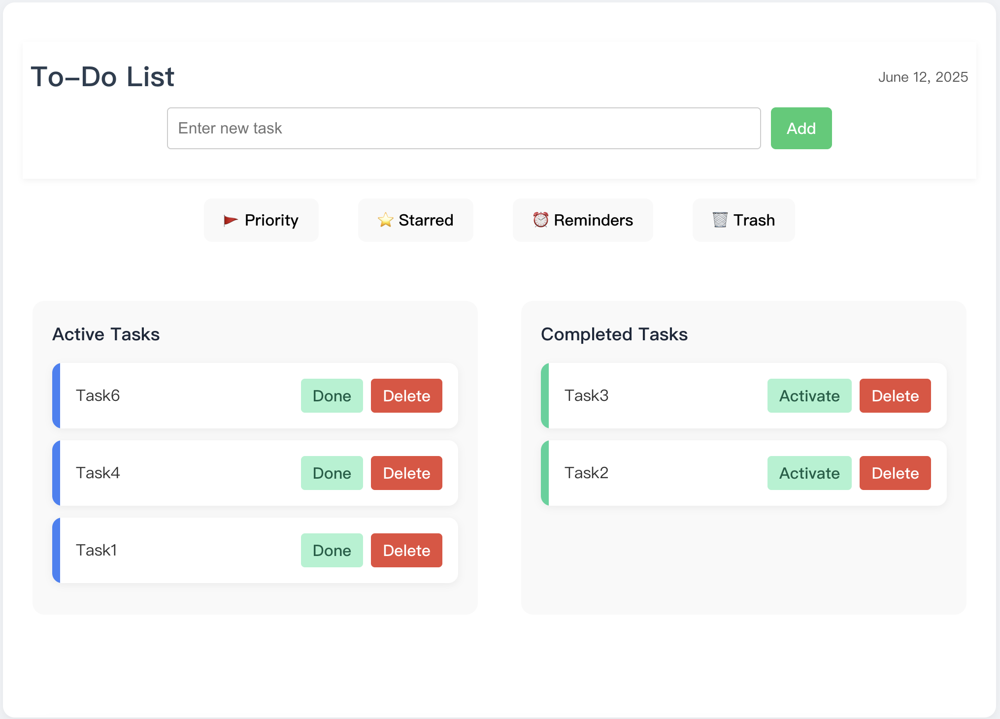
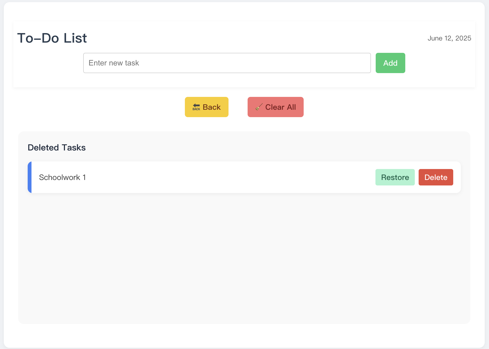

# Family To-Do List project feonted

**Family To-Do List** is a clean, minimal, and user-friendly task management web application built with modern React + TypeScript to-do list app featuring Zustand for state management, AuthGuard-like login simulation, localStorage persistence, and dynamic task detail pages.

This project is designed as a foundation for a fully functional mobile and desktop app, with the long-term goal of publishing it to the **App Store**. It demonstrates a solid understanding of component-based architecture, local data persistence, and interactive UI development in modern front-end technologies.


## Screenshots

### Main Interface
Shows the main task management view with Active and Completed task sections.



### Trash View
Displays deleted tasks, with options to restore or permanently delete.




## Features

- Add and manage your personal tasks efficiently.
- Organize tasks into **Active** and **Completed** columns.
- Mark tasks as **Important** using a red flag icon (🚩).
- Mark tasks as **Starred** for quick access (⭐).
- Set **Reminders** on tasks and receive pop-up alerts at specified times (⏰). *(Planned)*
- Soft-delete tasks into a **Trash** view (🗑️) instead of removing permanently.
- Restore or permanently delete tasks from the trash.
- Clean all trashed tasks with a single click.
- Seamlessly toggle between `main` and `trash` view.
- Visually distinct indicators for task status (color-coded).
- Data persistence using `localStorage` (your tasks won't disappear on refresh).
- Responsive design with clean minimalist UI.


##  Getting Started

Follow the instructions below to run the project locally on your machine.

### 1. Clone the Repository

```bash
git clone https://github.com/your-username/your-repo-name.git
cd your-repo-name
```

### 2. Install Dependencies

Make sure you have **Node.js (v14 or above)** installed.

```bash
npm install
```

### 3. Start the Development Server

```bash
npm run dev
```

Once the server is running, open your browser and go to:

```
http://localhost:5173
```

> This project uses **Vite** for fast hot-module reloading and development speed.

---

## 🚧 To-Do List (Upcoming Features)

We are actively improving this project. Here are some upcoming features and improvements:

- [ ] ⏰ **Task Reminder System**  
  Allow users to set a reminder time for each task. When the time is up, the app will notify the user via pop-up or browser notification.

- [ ] ⚙️ **State Management Upgrade with Zustand**  
  Refactor the current state logic to use [Zustand](https://github.com/pmndrs/zustand) for better performance and scalability.

- [ ] 🔐 **User Login & Account System**  
  Add a login page where users can register and log in to their own accounts, enabling personalized task lists and future cloud syncing features.

- [ ] 📊 **Daily Task Completion Visualization**  
  Display simple charts showing how many tasks the user completed each day. This helps users track productivity and stay motivated.


whole front end
